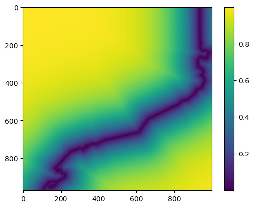

02. Preparing predictor variable fields
=======================================

In this tutorial, we’ll cover the preparation of the distance to the
coastline field using the parameters from another typical predictor
variable for air temperatures, altitude. The altitude predictor variable
is obtained using a Digital Elevation Model (DEM).

In PyMica, predictor variable fields used for interpolation must have
the same extension, spatial resolution, and projection. Therefore, the
DEM will be used as a reference to build the others.

Distance to Coastline
~~~~~~~~~~~~~~~~~~~~~

PyMica provides a utility to build a distance to the coastline field
using a DEM and a coastline GeoJSON file. Let’s now import the necessary
modules.

.. code:: python

    from osgeo import gdal
    
    from pymica.utils.distance_to_coastline import get_dist_array

For the ``get_dist_array`` function, we need four parameters:
projection, geotransform, size, and a coastline file. We’ll obtain the
first three from the DEM, and the coastline file will be sourced from
the explanatory folder.

.. code:: python

    dem_file = 'sample-data/explanatory/cat_dem_25831.tif'
    dem = gdal.Open(dem_file)
    
    projection = 25831
    geotransform = dem.GetGeoTransform()
    size = [dem.RasterXSize, dem.RasterYSize]
    coast_line = 'sample-data/explanatory/cat_coast_line.json'

Now, let’s check the values of each parameter.

.. code:: python

    print('Geotransform: ', geotransform)
    print('Size        : ', size)

.. parsed-literal::

    Geotransform:  (260000.0, 270.0, 0.0, 4750000.0, 0.0, -270.0)
    Size        :  [1000, 970]

Once all the parameters are set, we can call the ``get_dist_array``
function. First we’ll import it from
:py:mod:`pymica.utils.distance_to_coastline` and then apply it the previously
defined parameters.

.. code:: python

    dcoast_field = get_dist_array(proj=projection, geotransform=geotransform, size=size, dist_file=coast_line)

.. parsed-literal::

    Progress: 100%  

Now, we can get a quick look of the ``dcoast_field`` array using
``matplotlib``.

.. code:: python

    import matplotlib.pyplot as plt
    
    plt.imshow(dcoast_field)
    plt.colorbar()
    plt.show()

The coastline of Catalonia can be clearly identified. Values close to it
are low and exponentially grow as the distance increases from the coast.

Given that the distance to the coastline may be used as a predictor
variable, it would be interesting to save it in a raster file for future
use in multiple linear regression interpolations.

Then, let’s use the :py:meth:`pymica.utils.geotools.save_array_as_geotiff()` to
save the ``dcoast_field`` into a GeoTIFF file.

.. code:: python

    from pymica.utils.geotools import save_array_as_geotiff
    
    save_array_as_geotiff("sample-data/results/dcoast_example.tif", dcoast_field, geotransform, projection)

We have now completed this tutorial on how to prepare predictor variable
fields to use in the PyMICA class.
