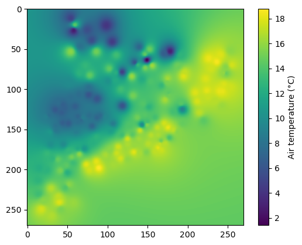

03. Interpolation - Inverse of the distance
===========================================

In this tutorial, we’ll cover the interpolation of point data using the
inverse of the distance methodology, available in PyMica as ``id2d``.
This methodology only requires location (``lon`` and ``lat``) and value
to interpolate.

We’ll use Meteorological Service of Catalonia sample data to demonstrate
how to apply this interpolation technique. Therefore, we need to import
the required modules. First, we need to load observation data and also
the PyMica class.

.. code:: python

    import json
    
    from pymica.pymica import PyMica

Let’s call the PyMica class with the appropriate parameters, setting the
methodology to ``id2d`` and the configuration dictionary as follows:

.. code:: python

    config_file = 'sample-data/configuration_sample.json'
    
    with open('sample-data/configuration_sample.json', 'r') as f_p:
        config = json.load(f_p)
    
    config['id2d']

.. parsed-literal::

    {'id_power': 2.5,
     'id_smoothing': 0.0,
     'interpolation_bounds': [260000, 4480000, 530000, 4750000],
     'resolution': 1000,
     'EPSG': 25831}

where:

-  ``id_power``: rate at which the influence of distant data points
   diminishes as we move away from them.
-  ``id_smoothing``: if 0.0 the interpolated value at that point
   location becomes identical to the observation value recorded at that
   precise data point.
-  ``interpolation_bounds``: [minimum_x_coordinate,
   minimum_y_coordinate, maximum_x_coordinate, maximum_y_coordinate]
-  ``resolution``: spatial resolution.
-  ``EPSG``: EPSG projection code.

With all these parameters and configurations set, let’s initialize the
``PyMica`` class with the methodology set to ‘id2d’.

.. code:: python

    id2d_method = PyMica(methodology='id2d', config=config_file)

Now that we have the interpolator set, we can input some data for
interpolation. We will use data from the Meteorological Service of
Catalonia AWS network.

.. code:: python

    with open('sample-data/data/smc_data.json', 'r') as f_p:
        data = json.load(f_p)
    
    data[0]

.. parsed-literal::

    {'id': 'C6',
     'value': 8.8,
     'lon': 0.9517200000000001,
     'lat': 41.6566,
     'altitude': 264.0,
     'dist': 0.8587308027349195}

As we can see, the first element of data meets the requirements of
``PyMica`` input data, so we only need to call the ``interpolate``
method from the interpolator class ``id2d_method``.

.. code:: python

    data_field = id2d_method.interpolate(data)

Now, we can get a quick look of the ``data_field`` array using
``matplotlib``.

.. code:: python

    import matplotlib.pyplot as plt
    
    plt.imshow(data_field)
    plt.colorbar(label='Air temperature (\u00b0C)')

Finally, we can save the result into a GeoTIFF file using
:py:meth:`pymica.pymica.PyMica.save_file()` from ``PyMica`` class.

.. code:: python

    id2d_method.save_file("sample-data/results/id2d.tif")

We have now completed this tutorial on how to interpolate station data
using the ``id2d`` methodology.
