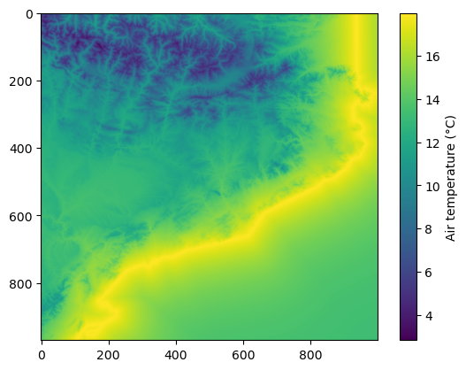

05. Interpolation - Multiple Linear Regression
==============================================

In this tutorial, we’ll cover the interpolation of point data using the
Multiple Linear Regression (MLR) methodology, available in PyMica as
``mlr``. This methodology requires location (``lon`` and ``lat``),
predictor variables such as altitude (``altitude``) or distance to coast
line (among others), and value to interpolate.

We’ll use Meteorological Service of Catalonia sample data to demonstrate
how to apply this interpolation technique. Therefore, we need to import
the required modules. First, we need to load observation data and also
the PyMica class.

.. code:: python

    import json
    
    from pymica.pymica import PyMica

Let’s call the PyMica class with the appropriate parameters, setting the
methodology to ``mlr`` and the configuration dictionary as follows:

.. code:: python

    config_file = 'sample-data/configuration_sample.json'
    
    with open('sample-data/configuration_sample.json', 'r') as f_p:
        config = json.load(f_p)
    
    config['mlr']

.. parsed-literal::

    {'clusters': 'None',
     'variables_files': {'altitude': 'sample-data/explanatory/cat_dem_25831.tif',
      'dist': 'sample-data/explanatory/cat_distance_coast.tif'},
     'interpolation_bounds': [260000, 4488100, 530000, 4750000],
     'resolution': 270,
     'EPSG': 25831}

where:

-  ``clusters``: set to None as no clusters will be used.
-  ``variables_files``: dictionary with predictor variables as keys and
   their corresponding GeoTIFF path as values. Here, altitude as
   ``altitude`` and distance to coast line as ``dist``.
-  ``interpolation_bounds``: [minimum_x_coordinate,
   minimum_y_coordinate, maximum_x_coordinate, maximum_y_coordinate], it
   must be the same as the variable files.
-  ``resolution``: spatial resolution.
-  ``EPSG``: EPSG projection code.

With all these parameters and configurations set, let’s initialize the
``PyMica`` class with the methodology set to ‘mlr’.

.. code:: python

    mlr_method = PyMica(methodology='mlr', config=config_file)

Now that we have the interpolator set, we can input some data for
interpolation. We will use data from the Meteorological Service of
Catalonia AWS network.

.. code:: python

    with open('sample-data/data/smc_data.json', 'r') as f_p:
        data = json.load(f_p)
    
    data[0]

.. parsed-literal::

    {'id': 'C6',
     'value': 8.8,
     'lon': 0.9517200000000001,
     'lat': 41.6566,
     'altitude': 264.0,
     'dist': 0.8587308027349195}

As we can see, the first element of the data meets the requirements of
PyMica input data and has the same predictor variables as the ones
provided in the configuration dictionary. Therefore, we only need to
call the ``interpolate`` method from the ``mlr_method`` interpolator
class.

.. code:: python

    data_field = mlr_method.interpolate(data)

Now, we can get a quick look of the ``data_field`` array using
``matplotlib``.

.. code:: python

    import matplotlib.pyplot as plt
    
    plt.imshow(data_field)
    plt.colorbar(label='Air temperature (\u00b0C)')

.. parsed-literal::

    <matplotlib.colorbar.Colorbar at 0x7f617d0cb520>

Finally, we can save the result into a GeoTIFF file using
:py:meth:`pymica.pymica.PyMica.save_file()` from ``PyMica`` class.

.. code:: python

    mlr_method.save_file("sample-data/results/mlr.tif")

We have now completed this tutorial on how to interpolate station data
using the ``mlr`` methodology. You can experiment with changing the
``variables_files`` in the configuration dictionary to observe how the
behavior of each variable affects the interpolation result.
