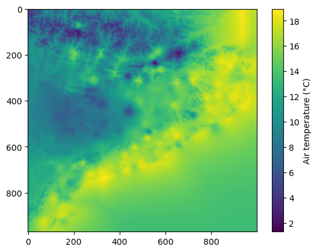
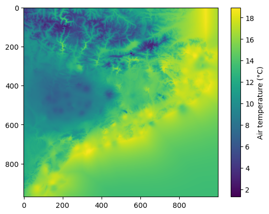

06. Interpolation - Multiple Linear Regression (+ residual correction)
======================================================================

In this tutorial, we’ll cover the interpolation of point data using the
Multiple Linear Regression (MLR) methodology and applying a residual
correction, available in PyMica as ``mlr+id2d`` and ``mlr+id3d``
depending on the residual correction interpolation method. This
methodology requires location (``lon`` and ``lat``), predictor variables
such as altitude (``altitude``) or distance to coast line (among
others), and value to interpolate. If ``mlr+id3d`` is selected,
``altitude`` must be provided in the ``variables_files``.

We’ll use Meteorological Service of Catalonia sample data to demonstrate
how to apply these interpolation techniques. Therefore, we need to
import the required modules. First, we need to load observation data and
also the PyMica class.

.. code:: python

    import json
    
    from pymica.pymica import PyMica

Interpolation mlr+id2d
~~~~~~~~~~~~~~~~~~~~~~

Let’s call the PyMica class with the appropriate parameters, setting the
methodology to ``mlr+id2d`` and the configuration dictionary as follows:

.. code:: python

    config_file = 'sample-data/configuration_sample.json'
    
    with open('sample-data/configuration_sample.json', 'r') as f_p:
        config = json.load(f_p)
    
    config['mlr+id2d']

.. parsed-literal::

    {'id_power': 2.5,
     'id_smoothing': 0.0,
     'clusters': 'None',
     'variables_files': {'altitude': 'sample-data/explanatory/cat_dem_25831.tif',
      'dist': 'sample-data/explanatory/cat_distance_coast.tif'},
     'interpolation_bounds': [260000, 4488100, 530000, 4750000],
     'resolution': 270,
     'EPSG': 25831}

where:

-  ``id_power``: rate at which the influence of distant data points
   diminishes as we move away from them.
-  ``id_smoothing``: if 0.0 the interpolated value at that point
   location becomes identical to the observation value recorded at that
   precise data point.
-  ``clusters``: set to None as no clusters will be used.
-  ``variables_files``: dictionary with predictor variables as keys and
   their corresponding GeoTIFF path as values. Here, altitude as
   ``altitude`` and distance to coast line as ``dist``.
-  ``interpolation_bounds``: [minimum_x_coordinate,
   minimum_y_coordinate, maximum_x_coordinate, maximum_y_coordinate], it
   must be the same as the variable files.
-  ``resolution``: spatial resolution.
-  ``EPSG``: EPSG projection code.

With all these parameters and configurations set, let’s initialize the
``PyMica`` class with the methodology set to ‘mlr+id2d’.

.. code:: python

    mlr_id2d_method = PyMica(methodology='mlr+id2d', config=config_file)

Now that we have the interpolator set, we can input some data for
interpolation. We will use data from the Meteorological Service of
Catalonia AWS network.

.. code:: python

    with open('sample-data/data/smc_data.json', 'r') as f_p:
        data = json.load(f_p)
    
    data[0]

.. parsed-literal::

    {'id': 'C6',
     'value': 8.8,
     'lon': 0.9517200000000001,
     'lat': 41.6566,
     'altitude': 264.0,
     'dist': 0.8587308027349195}

As we can see, the first element of the data meets the requirements of
PyMica input data and has the same predictor variables as the ones
provided in the configuration dictionary. Therefore, we only need to
call the ``interpolate`` method from the ``mlr_id2d_method``
interpolator class.

.. code:: python

    data_field = mlr_id2d_method.interpolate(data)

Now, we can get a quick look of the ``data_field`` array using
``matplotlib``.

.. code:: python

    import matplotlib.pyplot as plt
    
    plt.imshow(data_field)
    plt.colorbar(label='Air temperature (\u00b0C)')

.. parsed-literal::

    <matplotlib.colorbar.Colorbar at 0x7f645ca59450>

Now, we can save the result into a GeoTIFF file using ``save_file()``
from ``PyMica`` class.

.. code:: python

    mlr_id2d_method.save_file("sample-data/results/mlr_id2d.tif")

We have now completed the first part of this tutorial on how to
interpolate station data using the ``mlr+id2d`` methodology. The
obtained result is similar to the one in `05 Interpolation - Multiple
linear regression <05_howto_int_mlr.ipynb>`__, but with the additional
application of residual correction, which is evident in the interpolated
field. You can experiment with changing the ``variables_files``,
``id_power``, and ``id_smoothing`` parameters in the configuration
dictionary to observe how each parameter affects the interpolation
result.

mlr+id3d
~~~~~~~~

Let’s call the PyMica class with the appropriate parameters, setting the
methodology to ``mlr+id2d`` and the configuration dictionary as follows:

.. code:: python

    config_file = 'sample-data/configuration_sample.json'
    
    with open('sample-data/configuration_sample.json', 'r') as f_p:
        config = json.load(f_p)
    
    config['mlr+id3d']

.. parsed-literal::

    {'id_power': 2.5,
     'id_smoothing': 0.0,
     'id_penalization': 30,
     'clusters': 'None',
     'variables_files': {'altitude': 'sample-data/explanatory/cat_dem_25831.tif',
      'dist': 'sample-data/explanatory/cat_distance_coast.tif'},
     'interpolation_bounds': [260000, 4488100, 530000, 4750000],
     'resolution': 270,
     'EPSG': 25831}

where:

-  ``id_power``: rate at which the influence of distant data points
   diminishes as we move away from them.
-  ``id_smoothing``: if 0.0 the interpolated value at that point
   location becomes identical to the observation value recorded at that
   precise data point.
-  ``clusters``: set to None as no clusters will be used.
-  ``variables_files``: dictionary with predictor variables as keys and
   their corresponding GeoTIFF path as values. Here, altitude as
   ``altitude`` and distance to coast line as ``dist``. ``altitude`` is
   mandatory as selected residual correction is ``id3d``.
-  ``interpolation_bounds``: [minimum_x_coordinate,
   minimum_y_coordinate, maximum_x_coordinate, maximum_y_coordinate], it
   must be the same as the variable files.
-  ``resolution``: spatial resolution.
-  ``EPSG``: EPSG projection code.

With all these parameters and configurations set, let’s initialize the
``PyMica`` class with the methodology set to ‘mlr+id3d’.

.. code:: python

    mlr_id3d_method = PyMica(methodology='mlr+id3d', config=config_file)

The data we’ll use for interpolation is the same as the one used in the
``mlr+id2d`` section. Then, let’s call the ``interpolate`` class method.

.. code:: python

    data_field = mlr_id3d_method.interpolate(data)

Now, we can get a quick look of the ``data_field`` array using
``matplotlib``.

.. code:: python

    import matplotlib.pyplot as plt
    
    plt.imshow(data_field)
    plt.colorbar(label='Air temperature (\u00b0C)')

.. parsed-literal::

    <matplotlib.colorbar.Colorbar at 0x7f645c117f40>

Finally, we can save the result into a GeoTIFF file using
:py:meth:`pymica.pymica.PyMica.save_file()` from ``PyMica`` class.

.. code:: python

    mlr_id3d_method.save_file("sample-data/results/mlr_id3d.tif")

We have now completed this tutorial on how to interpolate station data
using the ``mlr`` methodology combined with residuals correction
(``id2d`` and ``id3d``). You can experiment with changing the
``variables_files`` in the configuration dictionary to observe how the
behavior of each variable affects the interpolation result.
