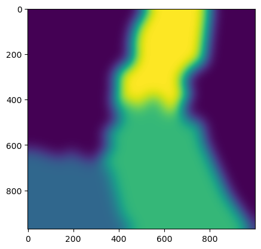

07. Clusters - Creation and rasterization
=========================================

Creation
~~~~~~~~

PyMica offers the possibility to apply different regional regression
models. However, before applying them, the regions must be defined, and
stations must be classified into these regions. This classification can
be based on various factors such as administrative boundaries, climate
regions, or automated methods, as is the case in this tutorial.

In this tutorial, we will use the K-Means algorithm to group stations.
The implementation of K-Means is available through the
`SciKit-Learn <https://scikit-learn.org/stable/>`__ package.

First, let’s load the required modules from the PyMica package,
specifically ``create_clusters``.

.. code:: python

    from pymica.utils.clusters import create_clusters

The :py:meth:`pymica.utils.clusters.create_clusters()` function takes five parameters:

1. Stations Data File Path: This parameter expects the path to a JSON
   file containing a list of stations that need to be grouped. Each
   station in the JSON file must have the following attributes:
   identification code (id), longitude (lon), and latitude (lat). For
   example:

   .. code:: json

      {"id": "AN", 
       "lon": 2.18091,
       "lat": 41.39004}

2. Number of Clusters: The K-Means algorithm allows you to specify the
   desired number of clusters into which the stations will be grouped.
   This parameter determines how many distinct regions or clusters the
   data will be divided into.

3. ESRI Shapefile: Path to an ESRI Shapefile where the clusters will be
   saved.

4. Extent: Bounding box (x min, y min, x max, y max) that defines the
   area where clusters will be created.

5. EPSG: The EPSG code for the coordinate reference system.

Now, let’s call the :py:meth:`pymica.utils.clusters.create_clusters()` function with the JSON file path
and set the resultant number of clusters to 3. We’ll use the bounding
box as [260000, 4488100, 530000, 4750000] and the EPSG code as 25831,
which corresponds to UTM 31N.

.. code:: python

    %%capture
    # We are capturing some warnings to prevent them from appearing during the execution of this cell
    create_clusters('sample-data/data/smc_data.json', 6, 'sample-data/clusters/clusters_6.shp', [260000, 4488100, 530000, 4750000], 25831)

After creating the clusters, we can check the output in any GIS to
determine in which cluster each station has been classified and to make
modifications if necessary.

Rasterization
~~~~~~~~~~~~~

Once the clusters are defined, whether automatically or following other
criteria, they need to be rasterized to be used by PyMICA for ``mlr``
(Multiple Linear Regression) interpolation methodologies, including
those with residual correction.

In this section, we will rasterize cluster polygons obtained from the
previous ESRI Shapefile and apply a blurring effect. The resulting
raster matrices will assign a value of 1 inside the polygon area and 0
outside of it. To avoid a sharp transition when merging clusters, a
blurring effect is performed.

To accomplish this task, we will use the
:py:meth:`pymica.utils.clusters.rasterize_clusters()` function. It requires an
ESRI Shapefile path and a dictionary with output properties as
parameters.

1. Clusters JSON file path or an ogr datasource object:

   This parameter expects either a file path pointing to the clusters’
   boundaries in the same format as obtained in the previous section, or
   it can receive an ogr datasource object. Users can choose to use
   automatically generated clusters or create their own.

2. Output properties:

   -  ``out_file``: The desired output file path and name.
   -  ``size``: The output raster size.
   -  ``geotransform``: The output raster geotransform.

For the first parameter, we will pass the ESRI Shapefile obtained
earlier.

In this case, we will set ``out_file`` as
``'sample-data/clusters/rasterized_clusters_3'``. The remaining two
parameters will be set to align with the extent and resolution of the
final interpolated field we want to obtain, matching the characteristics
of the Digital Elevation Model used in other tutorials.

.. code:: python

    out_properties = {'out_file'    : 'sample-data/clusters/rasterized_clusters_6',
                      'size'        : [1000, 970],
                      'geotransform': [260000, 270, 0, 4750000, 0, -270]}

Now, let’s call the :py:meth:`pymica.utils.clusters.rasterize_clusters()`.

.. code:: python

    from pymica.utils.clusters import rasterize_clusters
    
    rasterize_clusters('sample-data/clusters/clusters_6.shp', out_properties, sigma=30)

The clusters have been rasterized and saved as a GeoTIFF file.

Now, we can get a quick look of the ``data_field`` array using
``matplotlib``.

.. code:: python

    import matplotlib.pyplot as plt
    from osgeo import gdal
    
    clusters_fields = gdal.Open('sample-data/clusters/rasterized_clusters_6')
    clusters_fields = clusters_fields.ReadAsArray()
    
    plt.imshow(clusters_fields[0] * 1 + clusters_fields[1] * 2 + clusters_fields[2] * 3)

We have now completed this tutorial on how to create station clusters,
which can be applied in mlr methodologies. Feel free to experiment by
changing the number of clusters.
