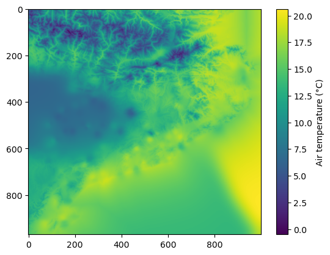

08. Interpolation - Multiple Linear Regression (+ Residual Correction) with Clusters
------------------------------------------------------------------------------------

In this tutorial, we will cover the interpolation of point data using
the Multiple Linear Regression (MLR) methodology, along with applying
residual correction. This is available in PyMica as ``mlr+id2d`` and
``mlr+id3d``, depending on the residual correction interpolation method.
We’ll use clustered data and regressions for this approach. The process
requires location information (``lon`` and ``lat``), predictor variables
such as altitude (``altitude``), or distance to the coastline (among
others), and the value to interpolate. If you choose ``mlr+id3d``,
``altitude`` must be provided in the ``variables_files``. Additionally,
it requires ESRI Shapefile clusters and the corresponding rasterized
fields.

We will use sample data from the Meteorological Service of Catalonia to
illustrate how to apply these interpolation techniques. To get started,
we need to import the necessary modules and load the observation data,
as well as the PyMica class.

.. code:: python

    import json
    
    from pymica.pymica import PyMica

Interpolation mlr+id2d with clusters
~~~~~~~~~~~~~~~~~~~~~~~~~~~~~~~~~~~~

Let’s call the PyMica class with the appropriate parameters, setting the
methodology to ``mlr+id2d`` and the configuration dictionary as follows:

.. code:: python

    config_file = 'sample-data/configuration_sample.json'
    
    with open('sample-data/configuration_sample.json', 'r') as f_p:
        config = json.load(f_p)
    
    config['mlr+id2d']

.. parsed-literal::

    {'id_power': 2.5,
     'id_smoothing': 0.0,
     'clusters': 'None',
     'variables_files': {'altitude': 'sample-data/explanatory/cat_dem_25831.tif',
      'dist': 'sample-data/explanatory/cat_distance_coast.tif'},
     'interpolation_bounds': [260000, 4488100, 530000, 4750000],
     'resolution': 270,
     'EPSG': 25831}

where:

-  ``id_power``: rate at which the influence of distant data points
   diminishes as we move away from them.
-  ``id_smoothing``: if 0.0 the interpolated value at that point
   location becomes identical to the observation value recorded at that
   precise data point.
-  ``clusters``: we will modify this parameter to apply interpolation
   with clusters.
-  ``variables_files``: dictionary with predictor variables as keys and
   their corresponding GeoTIFF path as values. Here, altitude as
   ``altitude`` and distance to coast line as ``dist``.
-  ``interpolation_bounds``: [minimum_x_coordinate,
   minimum_y_coordinate, maximum_x_coordinate, maximum_y_coordinate], it
   must be the same as the variable files.
-  ``resolution``: spatial resolution.
-  ``EPSG``: EPSG projection code.

If you want to incorporate clusters into the interpolation process, you
should define the ``"clusters"`` key as a dictionary with
``"clusters_files"`` and ``"mask_files"`` as its keys. Both keys should
contain a list of file paths:

.. code:: json

   "clusters": {
       "clusters_files": ["../sample-data/clusters_3.shp"],
       "mask_files": ["../sample-data/rasterized_clusters_3"]
   }

Let’s modify the configuration dictionary and save it to a new
configuration file.

.. code:: python

    config['mlr+id2d']['clusters'] = {
        "clusters_files": ["sample-data/clusters/clusters_6.shp"],
        "mask_files": ["sample-data/clusters/rasterized_clusters_6"]
    }
    
    with open('sample-data/configuration_clusters_sample.json', 'w') as fp:
        json.dump(config, fp)
    
    cluster_config_file = 'sample-data/configuration_clusters_sample.json'

With all these parameters and configurations set, let’s initialize the
``PyMica`` class with the methodology set to ‘mlr+id2d’.

.. code:: python

    mlr_id2d_clusters_method = PyMica(methodology='mlr+id2d', config=cluster_config_file)

Now that we have the interpolator set, we can input some data for
interpolation. We will use data from the Meteorological Service of
Catalonia AWS network.

.. code:: python

    with open('sample-data/data/smc_data.json', 'r') as f_p:
        data = json.load(f_p)
    
    data[0]

.. parsed-literal::

    {'id': 'C6',
     'value': 8.8,
     'lon': 0.9517200000000001,
     'lat': 41.6566,
     'altitude': 264.0,
     'dist': 0.8587308027349195}

As we can see, the first element of the data meets the requirements of
PyMica input data and has the same predictor variables as the ones
provided in the configuration dictionary. Therefore, we only need to
call the ``interpolate`` method from the ``mlr_id2d_clusters_method``
interpolator class.

.. code:: python

    data_field = mlr_id2d_clusters_method.interpolate(data)

Now, we can get a quick look of the ``data_field`` array using
``matplotlib``.

.. code:: python

    import matplotlib.pyplot as plt
    
    plt.imshow(data_field)
    plt.colorbar(label='Air temperature (\u00b0C)')

Finally, we can save the result into a GeoTIFF file using
``save_file()`` from ``PyMica`` class.

.. code:: python

    mlr_id2d_clusters_method.save_file("sample-data/results/mlr_id2d_clusters.tif")

We have now completed this tutorial on interpolating station data using
the ``mlr+id2d`` methodology with clusters. You can experiment by
changing the cluster files to observe how different cluster numbers
impact the interpolation results. If you wish to use ``mlr+id3d``, the
process would be similar.
