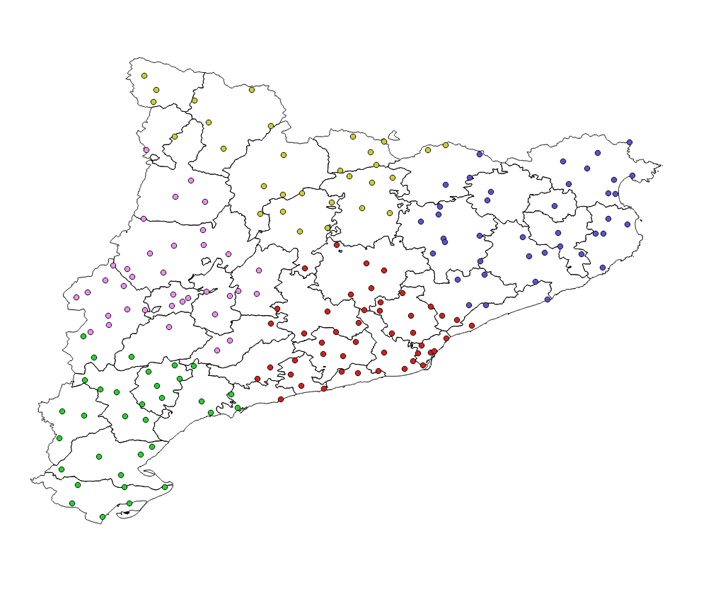
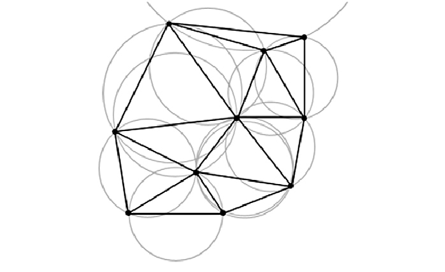

Clustering of weather stations
==============================

.. _d3delaunay: https://github.com/d3/d3-delaunay

In this section the process followed to classify weather stations in clusters
automatically is explained briefly. pyMICA provides a tool to build clusters,
which involve four steps:

1. :ref:`Weather stations classification`
2. :ref:`Delaunay triangulation`
3. :ref:`Voronoi diagram calculation`
4. :ref:`Export to GeoJSON`

Weather stations classification
-------------------------------
In order to classify weather stations spatially distributed over a region
into different groups, K-Means algorithm is used. It group stations by Euclidean
distance and it is implemented in this study using Sci-kit Learn (REF). K-Means
algorithm was chosen for its simplicity and also because it allows to define the
desired resultant number of clusters in which stations are grouped. This is 
critical for pyMICA as one of its main ideas is not to establish a predefined
number of clusters.

An example of the application of this algorithm is shown in :numref:`kmeans_5`.
The automatic weather stations network of the Meteorological Service of Catalonia
are classified in five different groups.

    Plot of the automatic weather stations of Catalonia classified in 5 clusters.

Delaunay triangulation
----------------------
Once the weather stations are classified in different groups a Delaunay triangulation
(REF) is performed. The triangulation implies that no point, weather stations in this
case, falls in the circumcircle of any triangle (:numref:`delane_circum`). It is implemented on pyMICA
using d3delaunay_ javascript repository.

    Plot of the circumcircles of Delaunay triangulation to randomly distributed points.
    Image taken from `here <https://www.researchgate.net/figure/A-delaunay-triangulation-in-the-plane-with-circumcircles_fig17_267981888>`_

If Delaunay triangulation is applied to a bigger number of spatially distributed
points, the result is shown in :numref:`delane_points`

.. figure:: _static/delaunay_points.png
    :name: delane_points
    :width: 550px
    :align: center
    :height: 400px
    :alt: Not available. kmeans_5_clusters.png
    :figclass: align-center

    Plot of the application of Delaunay triangulation to randomly distributed points.
    Image taken from d3delaunay_.

Voronoi diagram calculation
---------------------------
Once the Delaunay triangulation is performed, Voronoi diagram is calculated. This
diagram connects the circumcentres of adjacent triangles resultant from the 
Delaunay triangulation. It is implemented using the same 
d3delaunay_ repository as the above section.

If Voronoi diagram is applied to :numref:`delane_points` the following is obtained
:numref:`voronoi_points`

.. figure:: _static/voronoi_points.png
    :name: voronoi_points
    :width: 550px
    :align: center
    :height: 400px
    :alt: Not available. kmeans_5_clusters.png
    :figclass: align-center

    Plot of the calculation of Voronoi diagram to :numref:`delane_points`.
    Image taken from d3delaunay_.

Export to GeoJSON
-----------------

