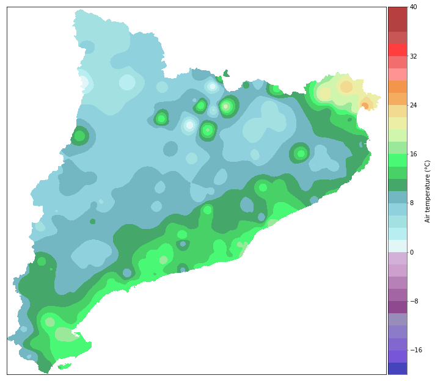
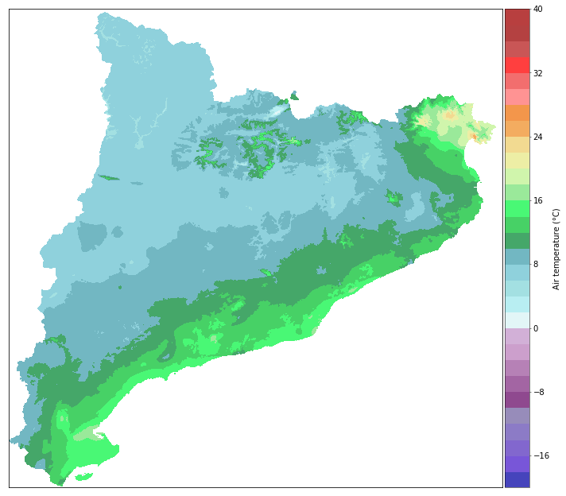
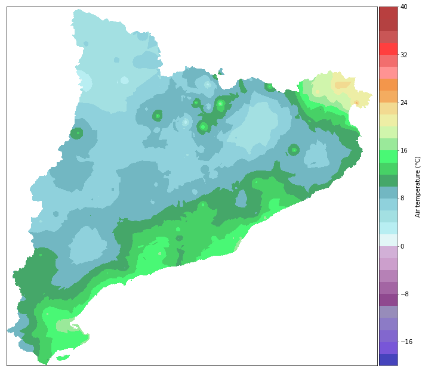

Tutorial 1: Residuals interpolation methodologies comparison
============================================================

Plots the same air interpolated field with different residual
interpolation methodologies:

a) :ref:`Inverse of the 2D distance`
b) :ref:`Inverse of the 3D distance`
c) :ref:`Inverse of the distance weighting`

In order to show the performance of the different interpolation
methodologies, we will call the ``pymica`` class. For this purpose we
will import it first.

.. code:: ipython3

    from pymica.pymica import PyMica

Since we only want to show the residuals interpolation we will use the
``pymica`` class with a single Multiple Linear Regression (MLR). It
receives five parameters:

-  data_file: The path of the .json file with the point data
-  variables_file: A list of the file(s) path(s) containing the fields
   of the explanatory variables used in the regression.
-  clusters: A dictionary with two keys {‘clusters_files’: path for the
   clusters definitions, ‘mask files’: path for the rasterized
   clusters}.
-  data_format: A dictionary with the name of the variables in the data
   file if they are not named as the default option. Defaults to
   ``{'loc_vars': ('lon', 'lat'), 'id_key': 'id', 'y_var': 'temp', 'x_vars': ('altitude', 'dist')}``
-  residuals_int: The indicator of the residuals interpolation
   methodology. Defaults to ``'id2d'`` (Inverse of the 2D distance).
   Methodologies available: ``'id2d'``, ``'id3d'`` (Inverse of the 3D
   distance) and ``'idw'`` (Inverse of the Distance Weighting).

Defining the parameters of PyMica class
---------------------------------------

First, we have to define ``data_file``, ``variables_file``, ``clusters``
and ``data_format`` parameters of PyMica class.

.. code:: ipython3

    data_file = '../envmodsoft/data/observations/xema_20181024_0500.json'
    variables_file = ['../sample-data/explanatory/cat_dem_25831.tif', '../sample-data/explanatory/cat_distance_coast.tif']
    clusters = None # We set this argument to None in order to calculate a single MLR model
    data_format = None

Inverse of the 2D distance
~~~~~~~~~~~~~~~~~~~~~~~~~~

To obtain the interpolated field with the anomaly correction using the
inverse of the 2D distance we must set ``residuals_int`` to ``id2d``.

.. code:: ipython3

    id_2d = PyMica(data_file, variables_file, clusters, data_format, residuals_int='id2d')

Now we can save the interpolated field into a .tif file calling the
``save_file`` function of ``pymica`` class and specifying the output
path.

.. code:: ipython3

    id_2d.save_file('../envmodsoft/output/residuals_id2d.tif')

Or we can plot a quick look of it using the plot_temp function with the
``result`` attribute of the ``pymica`` class instance.

.. code:: ipython3

    from plot_interpolation import plot_interpolation
    plot_interpolation('../envmodsoft/output/residuals_id2d.tif', 'temp')

Inverse of the 3D distance
~~~~~~~~~~~~~~~~~~~~~~~~~~

To obtain the interpolated field with the anomaly correction using the
inverse of the 3D distance we must set ``residuals_int`` to ``id3d``.

.. code:: ipython3

    id_3d = PyMica(data_file, variables_file, clusters, data_format, residuals_int='id3d')

Now we can save the interpolated field into a .tif file calling the
``save_file`` function of ``pymica`` class and specifying the output
path.

.. code:: ipython3

    id_3d.save_file('../envmodsoft/output/residuals_id3d.tif')

Or we can plot a quick look of it using the plot_temp function with the
``result`` attribute of the ``pymica`` class instance.

.. code:: ipython3

    plot_interpolation('../envmodsoft/output/residuals_id3d.tif', 'temp')

Inverse of the distance weighting
~~~~~~~~~~~~~~~~~~~~~~~~~~~~~~~~~

To obtain the interpolated field with the anomaly correction using the
inverse of the distance weighting we must set ``residuals_int`` to
``idw``.

.. code:: ipython3

    id_w = PyMica(data_file, variables_file, clusters, data_format, residuals_int='idw')

Now we can save the interpolated field into a .tif file calling the
``save_file`` function of ``pymica`` class and specifying the output
path.

.. code:: ipython3

    id_w.save_file('../envmodsoft/output/residuals_idw.tif')

Or we can plot a quick look of it using the plot_temp function with the
``result`` attribute of the ``pymica`` class instance.

.. code:: ipython3

    plot_interpolation('../envmodsoft/output/residuals_idw.tif', 'temp')

