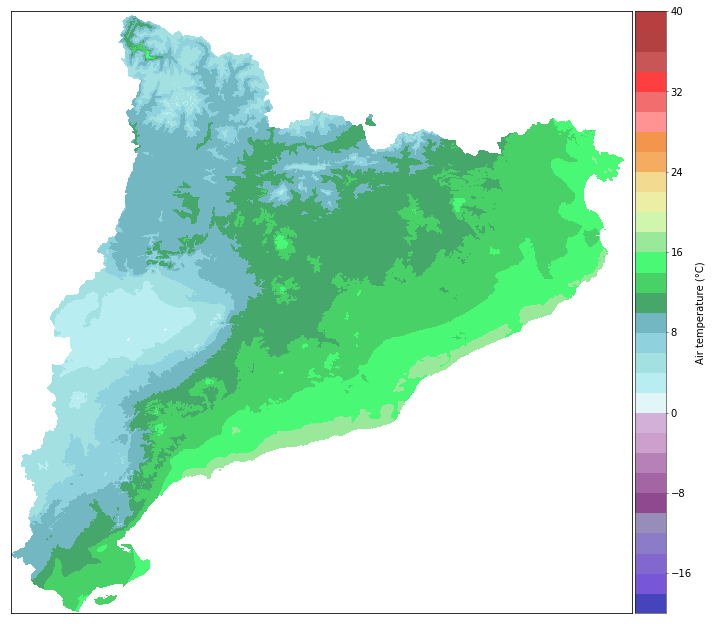
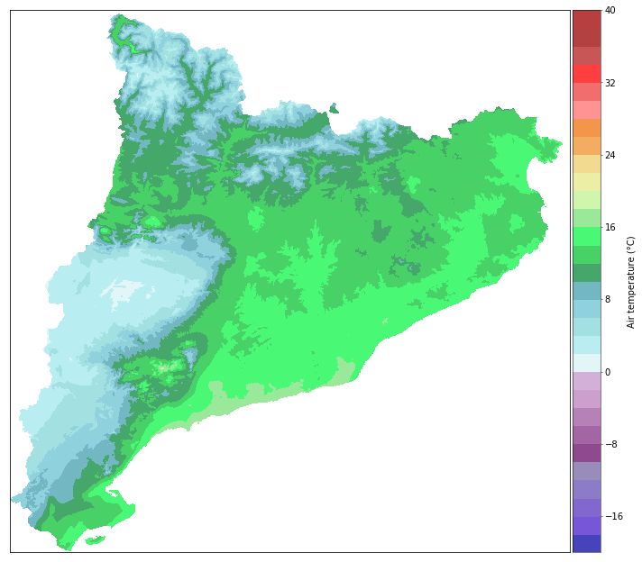

Tutorial 4: pyMICA class application
====================================

In this example we will show how to obtain interpolated fields
considering clusters or not. In this case data from the automatic
weather station network of the Meteorological Service of Catalonia (SMC)
will be used. Particularly, data from 31st December 2018, which
corresponds to a persistent fog situation.

The interpolated fields are obtained through the application of the main
class of the pyMICA library, PyMica. Therefore, we import it:

.. code:: ipython3

    from pymica.pymica import PyMica

PyMica class receives four parameters:

-  data_file: The path of the .json file with the point data
-  variables_file: A list of the file(s) path(s) containing the fields
   of the explanatory variables used in the regression. For more
   information on these fields, please see `Explanatory
   data <https://pymica.readthedocs.io/en/latest/ht_explanatory.html>`__ section.
-  clusters: A dictionary with two keys {‘clusters_files’: path for the
   clusters definitions, ‘mask files’: path for the rasterized
   clusters}. For more information on these fields, please see
   `Step 2 <https://pymica.readthedocs.io/en/latest/tutorial_02.html>`__.
-  data_format: A dictionary with the name of the variables in the data
   file if they are not named as the default option. Defaults to
   ``{'loc_vars': ('lon', 'lat'), 'id_key': 'id', 'y_var': 'temp', 'x_vars': ('altitude', 'dist')}``
-  residuals_int: The residuals interpolation methodology, which can be
   ``id2d`` (default), ``id3d`` and ``idw``.

Tutorial 4.1: Preparation of PyMica class parameters
----------------------------------------------------

From the four parameters above, three of them are the same either
clusters are considered or not (``data_file``, ``variables_file`` and
``data_format``). Therefore, we define them before explaining how to
obtain the interpolated fields with and without clusters.

For the interpolation we will consider two explanatory variables:
altitude and distance to coast. But first, we define the path to the
file containing the data.

.. code:: ipython3

    data_file = '../envmodsoft/data/observations/xema_max_20161213.json'

The first element of ``xema_20181231_1400.json`` is the following:

.. code:: json

      {"id": "C6", "temp": 2.1, "hr": 93.0, "tdew": 1.1, "altitude": 264.0, "lat": 41.6566, "lon": 0.95172, "dist": 0.8590799662714769}

Now, we define the paths of the altitude and distance to coast
explanatory fields:

.. code:: ipython3

    variables_files = ['../envmodsoft/data/explanatory/cat_dem_25831.tif', '../envmodsoft/data/explanatory/cat_distance_coast.tif']

Since ``loc_vars`` are ``lon`` and ``lat``, the ``id_key`` is ``id``,
the variable to interpolate is air temperature and it is labelled as the
default (``temp``) and the explanatory variables are also the default
ones, we can set the ``data_format`` parameter to ``None``.

.. code:: ipython3

    data_format = None

Finally, we select the residuals interpolation methodology. In this case
we chose the inverse of the 3D distance, ``id3d``.

.. code:: ipython3

    residuals_int = 'id3d'

Now, we have initialized the three parameters that are common for the
interpolation process that will be described below, either with or
without clusters.

Tutorial 4.2: Interpolation without clusters
--------------------------------------------

In this interpolation process, no clusters will be considered.
Therefore, the ``clusters`` parameter will be set to ``None``.

.. code:: ipython3

    clusters = None

Now, we call the PyMica class and save the result into what we called
``global_int``:

.. code:: ipython3

    global_int = PyMica(data_file, variables_files, clusters, data_format, residuals_int)

We save the interpolated field into a .tif file calling the
``save_file`` function of ``PyMica`` class and specifying the output
path.

.. code:: ipython3

    global_int.save_file('../envmodsoft/output/tair_20161213_max_noclusters.tif')

And we can also plot the interpolated field using the
``plot_interpolation`` function, specifically built for this example,
which requires the path of the interpolated raster file and specifying
the interpolated variable, in this case ``temp``:

.. code:: ipython3

    from plot_interpolation import plot_interpolation
    plot_interpolation('../envmodsoft/output/tair_20161213_max_noclusters.tif', 'temp')

Tutorial 4.3: Interpolation with clusters
-----------------------------------------

In this interpolation process, 3 and 6 clusters will be considered.
Therefore, the ``clusters`` parameter will be set accordingly by
defining the paths to the polygons and their rasters.

.. code:: ipython3

    clusters = {'clusters_files': ['../envmodsoft/clusters/clusters-3.json', '../envmodsoft/clusters/clusters-6.json'], 
                'mask_files': ['../envmodsoft/clusters/rasterized-clusters-3', '../envmodsoft/clusters/rasterized-clusters-6']}

Now, we call the PyMica class and save the result into what we called
``clusters_int``:

.. code:: ipython3

    clusters_int = PyMica(data_file, variables_files, clusters, data_format, residuals_int)

We save the interpolated field into a .tif file calling the
``save_file`` function of ``PyMica`` class and specifying the output
path.

.. code:: ipython3

    clusters_int.save_file('../envmodsoft/output/tair_20161213_max_clusters.tif')

And we can also plot the interpolated field using the
``plot_interpolation`` function, specifically built for this example,
which requires the path of the interpolated raster file and specifying
the interpolated variable, in this case ``temp``:

.. code:: ipython3

    from plot_interpolation import plot_interpolation
    plot_interpolation('../envmodsoft/output/tair_20161213_max_clusters.tif', 'temp')

