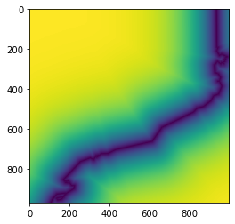

Create explanatory variables fields
===================================

MICA system works with Multiple Linear Regressions (MLR) whose
independent variables are known as explanatory variables. These
variables fields are needed in order to interpolate the regression
models. Then, before starting the MLR models calculation and the
interpolation itself, we need to prepare the explanatory data fields.

In this case we’ll show how to obtain altitude and distance to coast
fields.

Altitude
~~~~~~~~

A Digital Elevation Model (DEM) with the extent and resolution of the
final interpolated field we want to obtain. It must be a raster image.

Distance to coast
~~~~~~~~~~~~~~~~~

This raster is built using a logarithmic function
:math:`d_{coast} = 1 - e^{-\dfrac{3\cdot dist}{D}}`, where
:math:`d_{coast}` is the resultant distance to coast of the function,
*dist* is the Euclidean distance from a point to the coast line and *D*
is the distance where the distance to coast is cancelled.

The distance to coast raster is built using ``get_dist_array`` function.
Now, we’ll import it.

.. code:: ipython3

    from distance.distance_to_sea import get_dist_array

The ``get_dist_array`` function returns a matrix with the distance to
sea values. It receives as parameters:

-  proj : The EPSG code for the output matrix projection
-  geotransform: The output raster geotransform
-  size : The output raster size
-  dist_file : The path to an ogr compatible file with a line containing
   the shore geometry

Now, we’ll call the ``get_dist_array_function``.

.. code:: ipython3

    dist_file = '../sample-data/explanatory/cat_coast_line.json'
    dcoast_array = get_dist_array(proj=25831, geotransform=[260000, 270, 0, 4750000, 0, -270], size=[1000, 970], dist_file=dist_file)

.. parsed-literal::

    Progress: 100%  

Now we’ll save the ``dcoast_array`` as a .tiff image in order to keep it
for further steps in pyMICA. For this purpose, we’ll define the
``get_tif_from_array`` function and then, call it. It requires the
destination file path with the name of the file included, the data to
include in the .tiff, the geotransform and the EPSG projection of the
.tif file.

.. code:: ipython3

    from osgeo import gdal, osr
    
    def get_tif_from_array(file_path, data, geotransform, projection):
        '''
        Reads an array and returns a .tif
        Args:
            file_path (str): The path of the .tiff file to be saved
            data (array): Array of data to be transformed
            geotransform (array): Geotransform for the .tif file
            projection (int): EPSG projection code of the .tif file
        '''
        driver = gdal.GetDriverByName('GTiff')
        ds_out = driver.Create(file_path, data.shape[1], data.shape[0], 1, gdal.GDT_Float32)
        ds_out.GetRasterBand(1).WriteArray(data)
        ds_out.GetRasterBand(1).SetNoDataValue(0)
        ds_out.SetGeoTransform(geotransform)
        spatialRef = osr.SpatialReference()
        spatialRef.ImportFromEPSG(projection)
        ds_out.SetProjection(str(spatialRef))
    
        ds_out = None

.. code:: ipython3

    get_tif_from_array(file_path = '../sample-data/results/dcoast_sample.tif',
                       data = dcoast_array,
                       geotransform = [260000, 270, 0, 4750000, 0, -270],
                       projection = 25831)

Now, a .tif file including the dcoast_array is saved in
./notebooks/preprocessing/dcoast.tiff

If we want to have a quick look on dcoast_array we can plot it using
imshow.

.. code:: ipython3

    import matplotlib.pyplot as plt
    plt.imshow(dcoast_array)
    plt.show()

The required raster fields where the regression models will be applied
have been created.