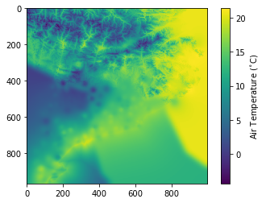

Interpolate with one number of clusters
=======================================

This example shows how MICA interpolates air temperature observations
using a Multiple Linear Regression with altitude and distance to coast
as explanatory variables and an anomaly correction of the residues. One
number of clusters is considered, in the present case, four. This means
that stations are classified in four different groups (clusters).

For this example, we’ll use the automatically defined clusters obtained
in `Clusters <https://pymica.readthedocs.io/en/latest/ht_clusters.html>`__ Section.

First, we’ll import the Pymica class.

.. code:: ipython3

    from pymica.pymica import PyMica

PyMica class receives four parameters:

-  data_file: The path of the .json file with the point data
-  variables_file: A list of the file(s) path(s) containing the fields
   of the explanatory variables used in the regression. For more
   information on these fields, please see `Explanatory
   data <https://pymica.readthedocs.io/en/latest/ht_explanatory.html>`__ section.
-  clusters: A dictionary with two keys {‘clusters_files’: path for the
   clusters definitions, ‘mask files’: path for the rasterized
   clusters}. Form more information on these fields, please see
   `Clusters <https://pymica.readthedocs.io/en/latest/ht_clusters.html>`__ section.
-  data_format: A dictionary with the name of the variables in the data
   file if they are not named as the default option. Defaults to
   ``{'loc_vars': ('lon', 'lat'), 'id_key': 'id', 'y_var': 'temp', 'x_vars': ('altitude', 'dist')}``

Defining the parameters of PyMica class
~~~~~~~~~~~~~~~~~~~~~~~~~~~~~~~~~~~~~~~

First, we have to define ``data_file``, ``variables_file``, ``clusters``
and ``data_format`` parameters of PyMica class.

.. code:: ipython3

    data_file = '../sample-data/data/xema_20181231_1400.json'

The first element of sample_data.json is the following:

.. code:: json

      {"id": "C6", "temp": 6.4, "altitude": 264, "lon": 0.95172, "lat": 41.6566, "dist": 0.8583929293407604}

.. code:: ipython3

    variables_file = ['../sample-data/explanatory/cat_dem_25831.tif', '../sample-data/explanatory/cat_distance_coast.tif']
    clusters = {'clusters_files':['../sample-data/clusters/clusters_4.json'],
                'mask_files':['../sample-data/clusters/clusters_4_mask']}
    data_format = None

And now, we can call the PyMica class.

.. code:: ipython3

    cluster_4_int = PyMica(data_file, variables_file, clusters, data_format)

We can plot a quicklook of the resultant air temperature interpolated
field using imshow function.

.. code:: ipython3

    import matplotlib.pyplot as plt
    plt.imshow(cluster_4_int.result)
    cbar = plt.colorbar()
    cbar.set_label('Air Temperature ($^{\circ}$C)')
    plt.show()

Or we can just save the result into a .tif file using ``save_file``
function of PyMica class.

.. code:: ipython3

    cluster_4_int.save_file('../sample-data/results/cluster_4_int.tif')