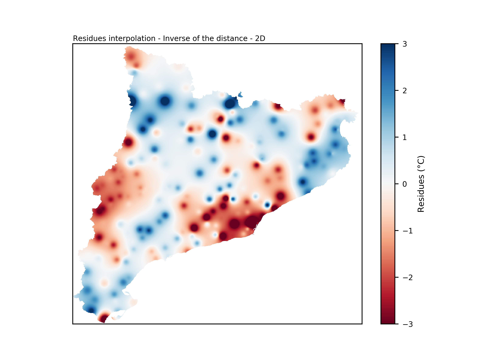
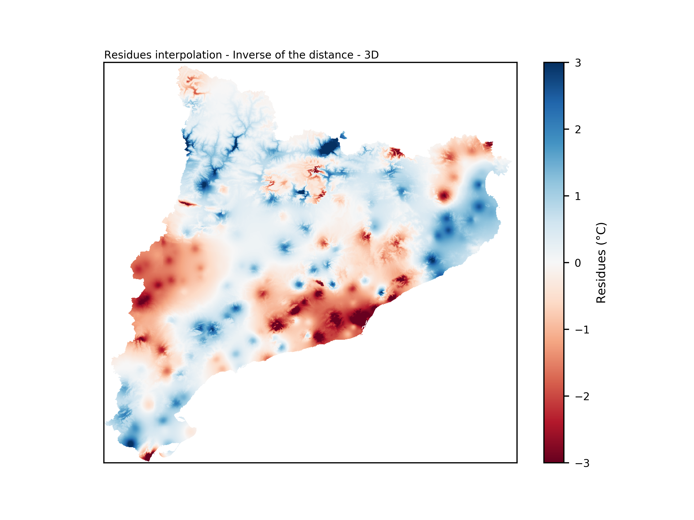

Interpolation methodologies
===========================

Inverse of the Distance - 2D
----------------------------

This interpolation technique takes into account the Euclidean distance between
points and stations. A residue value is calculated for every point in the region,
considering the quadratic inverse of the distance between the point and all the
stations.

The formula used to calculate the residue at a specific point *P* is as follows:

.. math::

    dist_{2D} = \sqrt{(x_{k} - x_{i})^{2} + (y_{k} - y_{j})^{2}}

    W_{ij} = \sum_{k}^{} \dfrac{1}{(dist_{2D})^{2}}

    R_{ij} = \dfrac{1}{W_{ij}} \sum_{k}^{} \dfrac{R_{k}}{(dist_{2D})^{2}}

Where:

- :math:`P = (x_{i}, y_{j})` represents the point where the residue is calculated.
- :math:`dist_{2D}` is the distance between point *P* and station *k*.
- :math:`W_{ij}` is the sum of station weights.
- :math:`R_{ij}` is the residue at point *P*.

This technique accounts for the spatial distribution of stations and their influence on
the interpolated values, providing more accurate estimates for various geographic points.

Here an example result of the interpolation of residuals using this methodology.

    Interpolation result using Inverse of the distance - 2D.

Inverse of the Distance - 3D
----------------------------

This methodology accounts not only for the distance between a point and a station but
also considers the difference in altitude. The altitude difference is multiplied by a
penalization factor :math:`\lambda`. A higher value of :math:`\lambda` results in more
emphasis being placed on stations with a larger difference in altitude. In other words,
if two stations are at the same horizontal distance from a point, but one station is at
the same altitude while the other is 1000 meters higher, a greater distance will be associated
with the second station. This methodology is adapted from `Frei, 2014 <https://doi.org/10.1002/joc.3786>`_ and
`Lussana et al., 2018 <https://doi.org/10.1002/qj.3208>`_.

The formula used to calculate the residue at a specific point *P* is as follows:

.. math::

    dist_{3D} = \sqrt{(dist_{2D})^{2} + \lambda(z_{k} - z_{ij})^{2}}

    W_{ij} = \sum_{k}^{} \dfrac{1}{(dist_{3D})^{2}}

    R_{ij} = \dfrac{1}{W_{ij}} \sum_{k}^{} \dfrac{R_{k}}{(dist_{3D})^{2}}

Where:

- :math:`P = (x_{i}, y_{j})` represents the point where the residue is calculated.
- :math:`z_{ij}` is the altitude at point *P*.
- :math:`dist_{·D}` is the distance between point *P* and station *k* taking into account the altitude difference.
- :math:`\lambda` is the penalization factor for altitude difference.
- :math:`W_{ij}` is the sum of station weights.
- :math:`R_{ij}` is the residue at point *P*.

This methodology offers a more accurate interpolation by considering both spatial distance
and altitude difference, allowing for better predictions in three-dimensional scenarios.

Here an example result of the interpolation of residuals using this methodology.

    Interpolation result using Inverse of the distance - 3D.

Multiple Linear Regression
--------------------------

Multiple Linear Regression (MLR) allows for the prediction of a response
variable using different explanatory variables, as opposed to only one in
simple linear regressions. It can be expressed as:

.. math::

    y_{i} = \sum_{k}^{} \beta_{k}x_{ik} + \epsilon_{i}

Where:

- :math:`y_{i}` is the predictand.
- :math:`\beta_{k}` are the coefficients of linear regression.
- :math:`x_{ik}` are the predictors.
- :math:`\epsilon_{i}` are the residues of the regression, which represent the difference between the predicted and observed values.

In the case of MLR, the predictors are included in a forward stepwise process.
First, the correlation coefficient is tested for each predictor. The one that
correlates the best is selected and left out for the next step. Second, each
of the remaining predictors is added to the previous regression. If the correlation
coefficient combining the first predictor and the second one improves by at least a
threshold of 0.05, a second predictor is considered. The one that improves the
correlation coefficient the most is selected. This process is repeated until the
improvement of adding one predictor is less than the established threshold or there
are no more predictors available.
