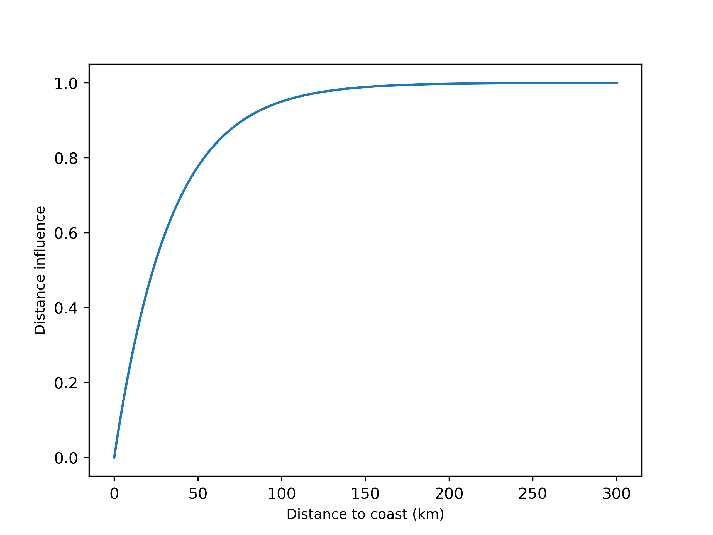

Multiple Linear Regression
==========================
A multiple linear regression (MLR) allows to predict a response variables using
different explanatory variables, rather than only one in linear regressions and
can be expressed as:

.. math::

    y_{i} = \sum_{k}^{} \beta_{k}x_{ik} + \epsilon_{i}

where :math:`y_{i}` is the predictand, :math:`\beta_{k}` are the coefficients of 
linear regression, :math:`x_{ik}` are the predictors and :math:`\epsilon_{i}` are 
the residues of the regression, the difference between the predicted and observed 
value.

In this case, the predictors are included in the MLR in a forward stepwise process.
Firstly, the correlation coefficient is tested for each predictor. The one that 
correlates the best is selected and left out for the next step. Secondly, each of 
the left predictors is added to the previous regression. If the correlation coefficient
combining the first predictor and the second one improves at least a threshold of 
0.05, a second predictor is considered. The one that improves the most the correlation 
coefficient is selected. The same process is repeated until the improvement of adding 
one predictor is less than the threshold established or there are no more predictors 
available.

Explanatory variables
---------------------
The explanatory variables or predictors are those considered to predict a response variable. In this
study, altitude, longitude, latitude and distance to cost were selected.

Altitude can be derived from a Digital Elevation Model (DEM). For Catalonia study case,
a 250-m resolution DEM was selected. Longitude, latitude and distance to coast are 
defined considering the resolution and the extent of the selected DEM. However, the 
latter is calculated through a logarithmic function rather than considering the Euclidean
distance itself and can be expressed as:

.. math::

    d_{sea} = 1 - e^{-\dfrac{3\times dist}{D}}

where :math:`d_{sea}` is the resultant distance to coast of the function, *dist* is the 
Euclidean distance from a point to the coast line and *D* is the distance where the 
distance to coast is cancelled. A plot of this function is shown at :numref:`dsea_function`
considering *D* =100 km.

    Plot of the distance to coast function with *D* = 100 km

This function is 0 at the coast line and :math:`\sim` 1 when the Euclidean distance 
(*dist*) is equal or higher a defined distance (*D*). This way, a higher weight is given to
those stations that are close to the sea. On the contrary, those stations that are far 
form the coast line have the same :math:`d_{sea}` value as there is nearly no differences,
in terms of sea influence, being 150 km or 300 km to coast. An example of the :math:`d_{sea}`
function applied to a map is shown at :numref:`dsea_map`

.. figure:: _static/dsea_function_map.png
    :name: dsea_map
    :width: 600px
    :align: center
    :height: 500px
    :alt: Not available. Distance to sea map.
    :figclass: align-center

    Map of Catalonia and the corresponding distance to coast function. *D* =100 km.