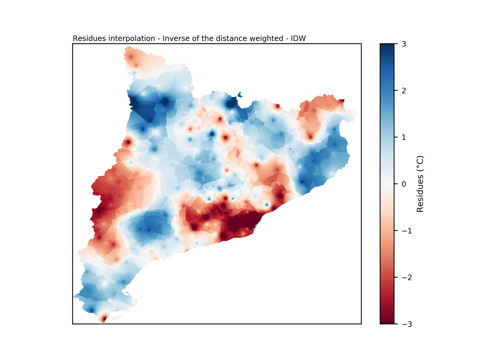
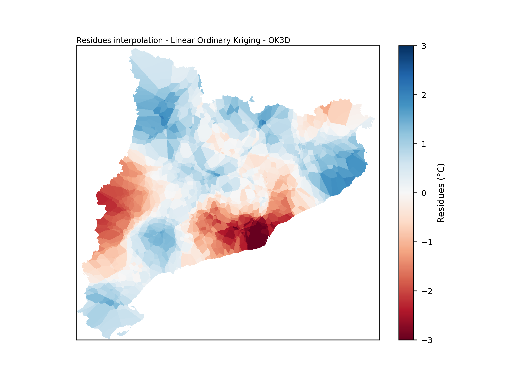

Residues interpolation
======================
There are different residues interpolation techniques available in pyMICA:

- :ref:`Inverse of the distance - 2D`
- :ref:`Inverse of the distance - 3D`
- :ref:`Inverse of the distance weighted - IDW`
- :ref:`3D Ordinary Kriging - OK3D`

Inverse of the distance - 2D
----------------------------
The starting point of MICA used this interpolation technique which takes into account
the Euclidean distance between points and stations. A residue value is calculated for
every point of the region considering the quadratic inverse of the distance between 
the point and all the stations. A resultant example map is shown in :numref:`iod_2d`.

The formula used to calculate the residue in a specific point *P* is the following:

.. math::

    dist_{2D} = \sqrt{(x_{k}-x_{i})^{2} + (y_{k}-y_{j})^{2}}

    W_{ij} = \sum\limits_{k}^{} \dfrac{1}{(dist_{2D})^{2}}

    R_{ij} = \dfrac{1}{W_{ij}} \sum\limits_{k}^{} \dfrac{R_{k}}{(dist_{2D})^{2}}

where :math:`P = (x_{i}, y_{j})` is the point where residue is calculated, :math:`dist_{2D}`
is the distance between *P* and station *k*, :math:`W_{ij}` is the sum of station weights
and :math:`R_{ij}` is the residue at point *P*.

.. figure:: _static/iod2d_residues_map.png
    :name: iod_2d
    :width: 650px
    :align: center
    :height: 500px
    :alt: Not available. Inverse of the distance 2D.
    :figclass: align-center

    Plot of the interpolated residues considering Inverse of the distance - 2D.

Inverse of the distance - 3D
----------------------------
This methodology does not account only for the distance between point and station, but
also considers the difference of altitude. This difference is multiplied by a penalization
factor :math:`\lambda`. The higher the :math:`\lambda` the more distance will be associated with stations
that present a bigger difference of altitude. In other words, if two stations are at the
same distance to a point, but one is at the same altitude and the other is 1000 m higher,
a greater distance will be assigned to the second station. This is methodology is adapted 
from [Fre_2014]_ and [Lus_2018]_.

The formula used to calculate the residue in a specific point *P* is the following:

.. math::

    dist_{3D} = \sqrt{(dist_{2D})^{2} + \lambda(z_{k}-z_{ij})^{2}}

    W_{ij} = \sum\limits_{k}^{} \dfrac{1}{(dist_{3D})^{2}}

    R_{ij} = \dfrac{1}{W_{ij}} \sum\limits_{k}^{} \dfrac{R_{k}}{(dist_{3D})^{2}}

where :math:`P = (x_{i}, y_{j})` is the point where residue is calculated, :math:`z_{ij}`
is the altitude at point *P*, :math:`dist_{·D}` is the distance between *P* and station
*k* accounting for altitude difference, :math:`\lambda` is the penalization factor 
for altitude difference, :math:`W_{ij}` is the sum of station weights and 
:math:`R_{ij}` is the residue at point *P*.

.. figure:: _static/iod3d_residues_map.png
    :name: iod_3d
    :width: 650px
    :align: center
    :height: 500px
    :alt: Not available. Inverse of the distance 3D.
    :figclass: align-center

    Plot of the interpolated residues considering Inverse of the distance - 3D.

Inverse of the distance weighted - IDW
--------------------------------------
This is an interpolation method that computes the score of query points 
based on the scores of their k-nearest neighbours, weighted by the inverse of 
their distances. It is density dependant as sharp gradient variations are captured
when point (weather stations) density is high. Otherwise, smoothness is imposed for
low point density.

It is implemented on pyMICA using 
`IDW git repository <https://github.com/paulbrodersen/inverse_distance_weighting>`_
and an IDW residues interpolation map is shown in :numref:`idw_2d`

    Plot of the interpolated residues considering Inverse of the distance weighted - IDW.

3D Ordinary Kriging - OK3D
--------------------------
The last option available for residues interpolation is kriging. In this case, 
three-dimensional ordinary kriging was selected in order to account for altitude rather than
horizontal distances only. This methodology is implemented using 
`pyKrige <https://github.com/bsmurphy/PyKrige>`_.

Kriging is similar to IDW as it accounts for the nearest observed values, where observations
are weighted using the distance between them and the point where the prediction is made.
However, unlike IDW, kriging also considers the spatial autocorrelation of the observations. An 
empirical semivariogram is obtained and fitted using a linear, spherical or power model
among other options available in pyKrige.

For simplicity, only linear model is considered in this version. An example of an OK3D
residues interpolation map is shown in :numref:`ok_3d` 

    Plot of the interpolated residues considering 3D Ordinary Kriging - OK3D.

.. rubric:: References

.. [Fre_2014] Frei, C. (2014). Interpolation of temperature in a mountainous region 
   using nonlinear profiles and non‐Euclidean distances. 
   *International Journal of Climatology, 34* (5), 1585-1605.

.. [Lus_2018] Lussana, C., Tveito, O. E., & Uboldi, F. (2018). Three‐dimensional
    spatial interpolation of 2 m temperature over Norway. 
    *Quarterly Journal of the Royal Meteorological Society, 144* (711), 344-364.