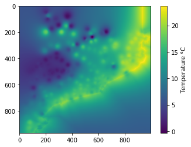
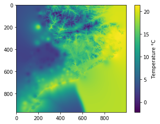

Step 3: Interpolation with and without clusters
===============================================

In this part of the tutorial and with all required data built and
available in correspondent folders, we’ll obtain an air temperature
interpolated field. For this purpose we’ll use PyMica class, which needs
as parameters the following ones:

-  data_file: The path of the .json file with the point data
-  variables_file: A list of the file(s) path(s) containing the fields
   of the explanatory variables used in the regression. For more
   information on these fields, please see `Explanatory
   data <https://pymica.readthedocs.io/en/latest/ht_explanatory.html>`__ section.
-  clusters: A dictionary with two keys {‘clusters_files’: path for the
   clusters definitions, ‘mask files’: path for the rasterized
   clusters}. Form more information on these fields, please see
   `Clusters <https://pymica.readthedocs.io/en/latest/ht_clusters.html>`__ section.
-  data_format: A dictionary with the name of the variables in the data
   file if they are not named as the default option. Defaults to
   ``{'loc_vars': ('lon', 'lat'), 'id_key': 'id', 'y_var': 'temp', 'x_vars': ('altitude', 'dist')}``

Before starting with different interpolation examples, we must import
the PyMica class. We also import matplotlib in order to plot the result.

.. code-block:: python

    import matplotlib.pyplot as plt
    from pymica.pymica import PyMica

Since data_file, variables_file and data_format will be the same for the
examples below, we’ll define them now.

.. code-block:: python

    data_file = '../sample-data/data/xema_20181231_1400.json'
    variables_file = ['../sample-data/explanatory/cat_dem_25831.tif',
                      '../sample-data/explanatory/cat_distance_coast.tif']
    data_format = {'loc_vars': ('lon', 'lat'),
                   'id_key': 'id',
                   'y_var': 'temp',
                   'x_vars': ('altitude', 'dist')}

The examples in this tutorial are:

-  :ref:`3.1 Interpolation without clusters`
-  :ref:`3.2 Interpolation with one number of clusters`
-  :ref:`3.3 Interpolation with more than one number of clusters`

3.1 Interpolation without clusters
----------------------------------

In this example, no clusters will be considered, then ``clusters``
PyMica class parameter will be set to ``None``.

.. code-block:: python

    clusters = None

Now, we’re ready to call PyMica class!

.. code-block:: python

    noclusters_int = PyMica(data_file, variables_file, clusters, data_format)

Now we can save the result into a .tif file using PyMica ``save_file``
function:

.. code-block:: python

    noclusters_int.save_file('../sample-data/results/no_cluster_int.tif')

But, we can also plot a quick look of the interpolated field, with
``noclusters_int`` result attribute.

.. code-block:: python

    plt.imshow(noclusters_int.result)
    cbar = plt.colorbar()
    cbar.set_label('Temperature \u00b0C')
    plt.show()

3.2 Interpolation with one number of clusters
---------------------------------------------

Now, we’ll consider number of clusters 2. Remember that PyMica will
only keep those clusters that reduce the error of the field obtained
when no clusters are considered.

Then, we set ``clusters`` parameters as follows:

.. code-block:: python

    clusters = {'clusters_files':['../sample-data/clusters/clusters_2.json'],
                'mask_files':['../sample-data/clusters/clusters_2_mask']}

And now, we call PyMica class:

.. code-block:: python

    cluster_2_int = PyMica(data_file, variables_file, clusters, data_format)

Now we can save the result into a .tif file using PyMica ``save_file``
function:

.. code-block:: python

    cluster_2_int.save_file('../sample-data/results/cluster_2_int.tif')

But, we can also plot a quick look of the interpolated field, with
``cluster_2_int`` result attribute.

.. code-block:: python

    plt.imshow(cluster_2_int.result)
    cbar = plt.colorbar()
    cbar.set_label('Temperature \u00b0C')
    plt.show()

.. image:: _static/tutorial_03_cluster.png

3.3 Interpolation with more than one number of clusters
-------------------------------------------------------

Now, we’ll consider number of clusters 2 and 4. Remember that PyMica
will only keep those number of clusters that reduce the error of the
field obtained when no clusters are considered.

Then, we set ``clusters`` parameters as follows:

.. code-block:: python

    clusters = {'clusters_files':['../sample-data/clusters/clusters_2.json',
                                  '../sample-data/clusters/clusters_4.json'],
                'mask_files':['../sample-data/clusters/clusters_2_mask',
                              '../sample-data/clusters/clusters_4_mask']}

And now, we call PyMica class:

.. code-block:: python

    clusters_int = PyMica(data_file, variables_file, clusters, data_format)

Now we can save the result into a .tif file using PyMica ``save_file``
function:

.. code-block:: python

    clusters_int.save_file('../sample-data/results/clusters_4_int.tif')

But, we can also plot a quick look of the interpolated field, with
``clusters_int`` result attribute.

.. code-block:: python

    plt.imshow(clusters_int.result)
    cbar = plt.colorbar()
    cbar.set_label('Temperature \u00b0C')
    plt.show()

Finish!
-------

Now you can modify and change data, add more number of clusters, design your own clusters…!
^^^^^^^^^^^^^^^^^^^^^^^^^^^^^^^^^^^^^^^^^^^^^^^^^^^^^^^^^^^^^^^^^^^^^^^^^^^^^^^^^^^^^^^^^^^